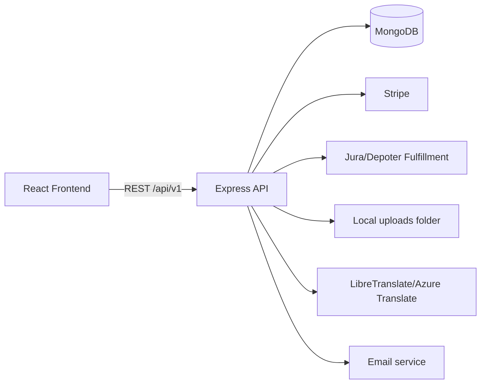
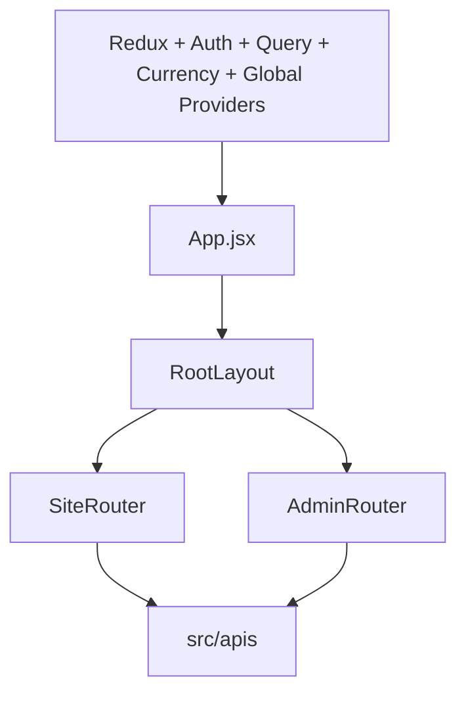
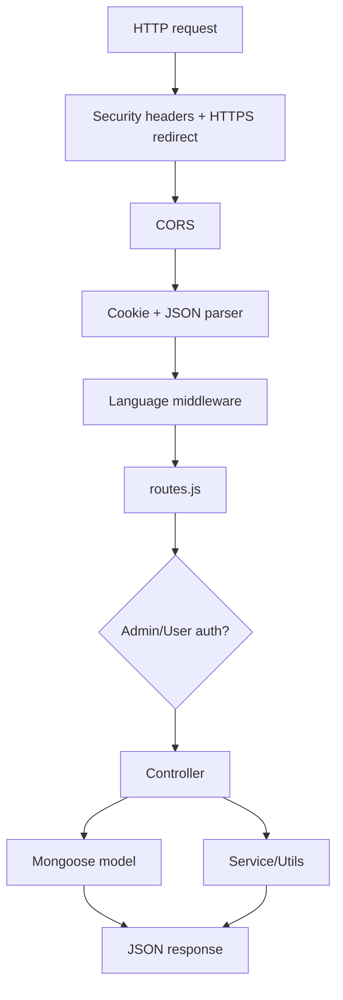

# Architecture

## High-Level System

The **MMMK WODE** project is a two-application ecommerce system:

- `MMK_frontend(13-03)`: Vite React application for storefront, user account flows, checkout, gift cards, and admin dashboard.
- `MMK_backend(13-03)`: Express API with MongoDB/Mongoose persistence, JWT authentication, file uploads, payment handling, translation, and fulfillment integrations.

## Frontend Architecture

The frontend is a Vite React SPA.

- Routing is defined in `src/App.jsx`, `src/router/SiteRouter.jsx`, and `src/router/AdminRouter.jsx`.
- Public storefront routes and user routes are under `SiteRouter`.
- Admin routes are under `/admin/*` and wrapped by `AdminProtectedRoute`.
- User-only routes are wrapped by `UserProtectedRoute`.
- Data fetching uses `@tanstack/react-query`.
- Global state is split across React contexts and Redux Toolkit:
  - `GlobalProvider`: categories, recommended/homepage products, language-aware global data.
  - `CartProvider`: cart operations and cart query state.
  - `CurrencyProvider`: selected currency and conversion rates.
  - `AdminAuthProvider` and `userAuthProvider`: auth state.
  - Redux store: translation slice and any legacy Redux state.
- API access is organized under `src/apis/admin`, `src/apis/user`, and `src/apis/nonAuth`.

## Backend Architecture

The backend is an Express application initialized in `app.js`.

Key layers:

- `app.js`: security headers, CORS, static uploads, JSON parsing, language detection, route mounting, health endpoint, error handler.
- `routes.js`: central route composition and auth boundary.
- `Routes/`: Express routers grouped by admin, public/non-auth, and user-authenticated features.
- `Controller/`: request handlers for admin, non-auth, and user flows.
- `Models/`: Mongoose models.
- `Middleware/`: JWT auth and error handling.
- `services/` and `utils/`: mail, translation, Jura/Depoter integration, stock, uploads, credit/coupon helpers.

## Authentication Flow

### Admin

1. Admin signs in via `POST /api/v1/admin/login`.
2. Backend verifies credentials against `Admin`.
3. Backend issues a JWT signed with `SECRET_KEY`.
4. Token is accepted either as `Authorization: Bearer <token>` or `adminAuthToken` cookie.
5. Protected admin routes are mounted behind `isAdmin`.

### User

1. User signs up via `POST /api/v1/user/signup` or logs in via `POST /api/v1/user/login`.
2. Backend verifies credentials against `User`.
3. Backend issues a JWT signed with `SECRET_KEY`.
4. Token is accepted either as `Authorization: Bearer <token>` or `userToken` cookie.
5. Protected user routes are mounted behind `isUser`.

Needs Verification: some frontend token storage details are implemented in utility/provider files and should be reviewed before changing auth persistence.

## Request Lifecycle

1. Browser sends REST request to `VITE_BACKEND_URL`.
2. Backend validates origin through CORS.
3. Backend parses cookies and JSON, except Stripe webhook raw-body route.
4. Language middleware sets `req.lang` from headers, query, body, or `Accept-Language`.
5. `routes.js` dispatches to public, admin-protected, or user-protected routers.
6. Controller reads params/body/query and calls models/services.
7. Response is returned as JSON.
8. Errors fall through `Middleware/errorHandler.js`.

## External Integrations

| Integration | Code Area | Purpose |
| --- | --- | --- |
| MongoDB | `Config/db.js`, `Models/` | Primary persistence. |
| Stripe | `Controller/user-controllers/payment.controller.js` | Payment intents, checkout sessions, webhooks. |
| Jura/Depoter | `services/jura.service.js`, `utils/jura*.js`, `utils/depoter*.js` | Product sync, order sync, delivery tracking, returns/exchanges. |
| Multer/local uploads | `utils/multer.js`, `/uploads` static route | Admin media uploads. |
| Translation | `services/translate.js`, `TranslationContext.jsx` | Server/client translation support. |
| Email | `services/mailService.js`, `utils/giftCardMailer.js` | Password reset, support/gift-card notifications. Needs Verification: exact SMTP config names. |

## Security Controls

`app.js` sets:

- HTTPS redirect in production when `x-forwarded-proto` is not `https`.
- `Strict-Transport-Security`.
- `X-Frame-Options: DENY`.
- `X-Content-Type-Options: nosniff`.
- `Referrer-Policy: strict-origin-when-cross-origin`.
- `Cross-Origin-Opener-Policy: same-origin`.
- `Cross-Origin-Resource-Policy: same-site`.
- A Content Security Policy.

Needs Verification: CSP compatibility with all frontend runtime behavior in production.
