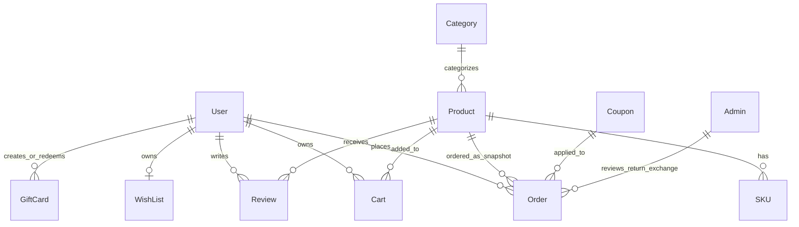

# Data Model

The **MMMK WODE** backend uses MongoDB with Mongoose models in `MMK_backend(13-03)/Models`.

## Entity Relationship Overview

## Collections

### Admin

Model: `Admin`

Fields:

- `username`: string, required.
- `password`: string, required, hashed by `pre("save")` hook.

### User

Model: `User`

Fields:

- `firstName`, `lastName`, `email`, `password`.
- `dateOfBirth`, `contactNumber`, `isVerified`, `gender`.
- `shippingAddresses[]`, `billingAddresses[]`: embedded address records.
- `paymentCards[]`: embedded card metadata.
- `credits`: number, default `0`.
- Timestamps enabled.

Important embedded address fields: `firstName`, `lastName`, `street_address`, `city`, `state`, `postalCode`, `country`, `company`, `phone_number`, `landmark`, `label`, `isDefault`.

### Category

Model: `Category`

Fields:

- `name`: localized object with `en` required and optional `ar`, `ru`, `fr`, `es`, `zh`, `ja`, `pt`, `it`, `de`.
- `image`: string, required.
- `subcategories[]`: localized string objects.
- `filters[]`: objects with required `name`.
- `order`: number, default `0`.
- Timestamps enabled.

### Product

Model: `Product`

Fields:

- `category`: ObjectId reference to `Category`.
- `subCategory`: string.
- `image`: string, required.
- `images[]`: string array.
- `quantity`, `weight`, `brand`.
- `homePageBottomSection`, `showOnHomepage`.
- `discount`: number, min `0`, max `100`.
- `gender`: enum `Men`, `Women`, `Unisex`.
- `status`: enum `Active`, `Out of stock`, `Inactive`.
- `productName`, `productDescription`, `uses`, `benefits`: localized objects.
- `price`, `websitePrice`.
- `reviews[]`: ObjectId references. Needs Verification: schema ref is `reviewModel`, while review model exports `Review`.
- `filters[]`: strings.
- `order`: number.
- Timestamps enabled.
- `strict: false`, so documents may contain additional dynamic fields.

### SKU

Model: `SKU`

Fields:

- `product`: ObjectId reference to `Product`, required.
- `sku`: string, required, unique.
- `quantity`: number, default `0`.
- `filters`: mixed object.
- Timestamps enabled.

### Cart

Model: `Cart`

Fields:

- `user`: ObjectId reference to `User`.
- `product`: ObjectId reference to `Product`.
- `sku`: string, required.
- `filters`: mixed object, default `{}`.
- `quantity`: number, default `1`.
- `type`: enum `Active`, `Inactive`, `Wishlist`, default `Active`.

### WishList

Model: `WishList`

Fields:

- `userId`: ObjectId reference to `User`, required.
- `products[]`: ObjectId references to `Product`.

### Order

Model: `Order`

Fields:

- `userId`: ObjectId reference to `User`, required.
- `orderId`: string, required, unique.
- `status`: enum `Pending`, `Processing`, `Complete`, `Cancelled`.
- `mode`: enum `cod`, `card`, `upi`.
- `amount`, `currency`, `totalQuantity`.
- `price`: embedded object with `subtotal`, `shippingCharges`, `discount`, `tax`, `extraCharges`, `couponDiscount`, `creditApplied`, `total`.
- `products[]`: embedded snapshots with product id, amount, quantity, sku, name.
- `paymentStatus`: enum `Pending`, `Paid`, `Failed`.
- `paymentIntentId`, `stripeSessionId`.
- `couponCode`.
- `shippingAddress`, `billingAddress`, `temp`: mixed objects.
- `stockAdjusted`, `creditsUsed`, `creditsDeducted`, `creditsRestored`.
- Delivery fields: `deliveryStatus`, `shipperName`, `awb`, `trackingUrl`, `deliveryDate`, `notifyCustomer`, `trackingHistory[]`.
- Depoter/Jura sync fields: `depoter_order_id`, `depoterSyncStatus`, `depoterSyncError`, `depoterSyncedAt`.
- Return/exchange requests with request status, items, reviewer, sync status, and external response.
- Timestamps enabled.

Virtuals map legacy Jura names to Depoter fields: `jura_order_id`, `juraSyncStatus`, `juraSyncError`, `juraSyncedAt`.

### Coupon

Model: `Coupon`

Fields:

- `couponName`, `couponCode`.
- `showToUsers`, `expiryDate`.
- `discount`, `discountType`: `percentage` or `amount`.
- `applyToProducts`, `applyToDelivery`.
- `deliveryDiscount`, `deliveryDiscountType`.
- `scope`: enum `All`, `Category`, `Product`.
- `scopeCategory`: ObjectId reference to `Category`.
- `scopeProduct`: ObjectId reference to `Product`.
- `currentUsage`.
- `usageHistory[]`: `orderId`, `saved`, `dateTime`.
- Timestamps enabled.

### GiftCard

Model: `GiftCard`

Fields:

- `name`, `code`, `password`, `amount`.
- `code`: unique.
- `status`: enum `Active`, `Redeemed`, `Expired`.
- `redeemedBy`: ObjectId reference to `User`.
- `redeemedAt`.
- `createdBy`: ObjectId reference to `User`.
- `paymentOrderId`: unique sparse string.
- `expiryDate`: defaults to one year after creation.
- `shareHistory[]`: recipient details, `sharedBy`, `sharedAt`, `emailStatus`.
- Timestamps enabled.

### Review

Model: `Review`

Fields:

- `product`: ObjectId reference to `Product`, required.
- `user`: ObjectId reference to `User`, required.
- `rating`: number, required.
- `review`: string.

### Support

Model: `Support`

Fields:

- `email`, `name`, phone fields, `subject`, `description`.
- `query`: string, required.
- `locale`: string, default `en`.
- `source`: string, default `contact-us`.
- Timestamps enabled.

### Filter

Model: `Filter`

Fields:

- `filterName`: string, required.
- `options[]`: mixed values.
- `subFilterName[]`: strings.

### Payment

Model: `Payment`, collection `payments`

Fields:

- `paymentId`, `amount`, `user`, `payType`.
- Timestamps enabled.

### Pricing

Model: `Pricing`

Fields:

- `shippingCost`: number, required.
- `taxes`: number, required.

### ResetToken

Model: `ResetToken`

Fields:

- `token`: string, required.
- `userId`: ObjectId reference to `User`, required.
- `createdAt`: TTL index via `expires: 900`.

### EditPage

Model: `EditPage`

Stores configurable home page and footer content:

- `home.banner`
- `home.section2`
- `home.section8`
- `home.section9`
- `home.section11`
- `home.section12.videos[]`
- `home.sectionProducts.section3_product`, `section7_product`
- `footer.image`, `footer.footerLinks[]`, `footer.footerContent`, `footer.socialLinks`

Many content fields are localized.

## Indexes

Explicit schema-level indexes were not found. Mongoose creates indexes for:

- `Order.orderId` unique.
- `SKU.sku` unique.
- `GiftCard.code` unique.
- `GiftCard.paymentOrderId` unique sparse.
- `ResetToken.createdAt` TTL through `expires: 900`.

Needs Verification: production database may have manually created indexes not represented in code.
